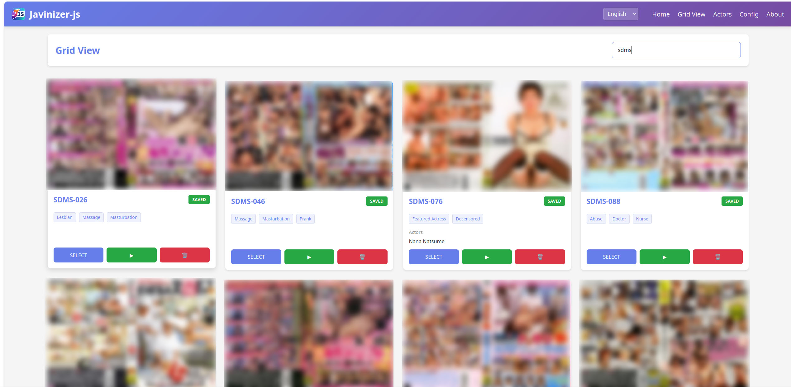
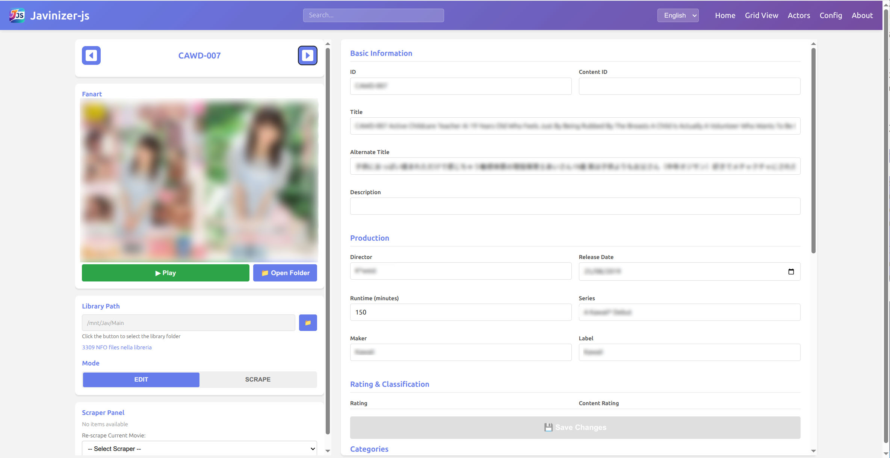
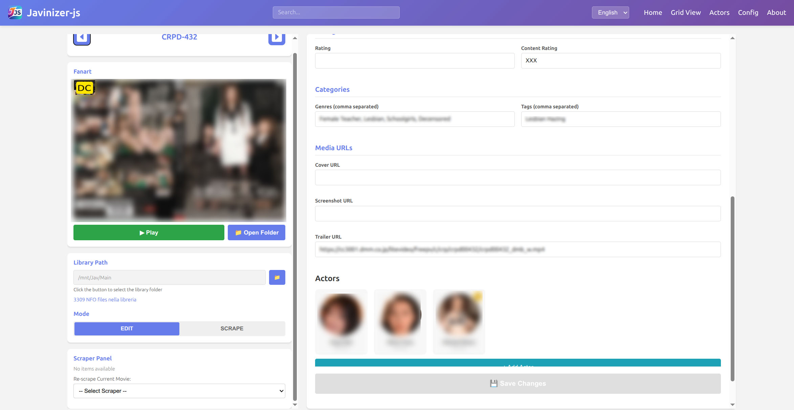
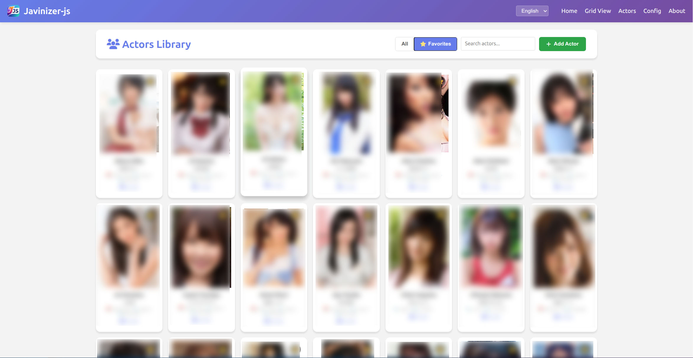

# Javinizer-js

> **A self-hosted JAV media manager — organize, scrape, edit and maintain your entire library**

Javinizer-js is a complete **self-hosted media manager designed specifically for JAV libraries**.

While the project originally started as a metadata scraper, it has evolved far beyond scraping. Today, Javinizer-js provides a complete web-based environment for **browsing, organizing, scraping, editing and maintaining movies and actors**, while keeping standard NFO files at the core of the library.

From a single interface you can browse your collection, search and edit movies, scrape metadata from multiple sources, manage genres and tags, maintain artwork, organize actors and alternate names, handle duplicates and favorites, and keep your library ready for **Jellyfin and Kodi**.

Javinizer-js is actively used to manage a real-world library of more than **3,300 movies**.

Its goal is simple: provide everything needed to manage a JAV collection without turning the setup itself into a project.

**Latest release:** [v2.3.0](https://github.com/AlaricRomeo/Javinizer-JS/releases/latest)

**License:** GPL-2.0-only

---

## 📸 Screenshots

### Library



### Movie Editor





### Actors Library




---

## 🎬 More Than a Scraper: A JAV Media Manager

Scraping is only one part of Javinizer-js.

The application is designed around the **library itself**, providing a complete interface for managing movies and their metadata before and after scraping.

You can:

* browse your entire collection through a visual grid;
* quickly search by title, ID, actor, genre and other metadata;
* open and manage individual movies;
* scrape metadata from multiple sources;
* manually edit NFO metadata;
* add, remove and organize genres and tags;
* manage posters and fanart;
* manage trailer URLs;
* edit studio, label, director, rating, runtime and other metadata;
* associate and manage actors;
* maintain a dedicated actors library;
* write and update NFO files directly from the interface;
* launch movies using a configured external player.

Javinizer-js does not require its own proprietary library format.

**Your movies, artwork and NFO files remain your library. Javinizer-js provides the tools to manage them.**

The generated NFO files are fully compatible with **Jellyfin and Kodi**.

---

## 🔎 Metadata Scraping

Javinizer-js includes dedicated scrapers for automatically retrieving movie metadata.

The project was primarily created for managing **censored JAV collections**, and the included scrapers were selected to provide broad metadata coverage for this type of content without unnecessarily multiplying data sources.

This is not an architectural limitation. The plugin-based design allows new scrapers and data sources to be added at any time, including sources covering other types of JAV content.

Anyone interested in developing a new scraper, improving an existing one, or simply suggesting a useful new source is welcome to contribute.

Scraping features include:

* automatic movie scraping;
* individual and batch scraping;
* configurable scraper priority;
* different scraper priorities for individual metadata fields;
* automatic merging of results from multiple sources;
* re-scraping existing movies;
* preservation of manual edits.

A complete movie file is **not required**.

Javinizer-js identifies movies from video filenames beginning with the movie ID. This means that even a trailer or short clip can be used as a placeholder when building or preparing a library.

---

## 🧩 Plugin-based Scrapers

The scraper system is completely modular.

Each scraper is independent and can be added without modifying the Javinizer-js core.

This applies to both **movie scrapers** and **actor scrapers**.

The included scrapers already cover the project's primary use cases, but the architecture places no practical restriction on the number of additional sources that can be implemented.

New scrapers can therefore be developed and added whenever a new source becomes useful.

Developers interested in creating new scrapers — or users who know of useful metadata sources — are welcome to contribute or suggest them.

Dedicated scraper development documentation is included in the repository.

---

## 🌐 Scraping With or Without FlareSolverr

Javinizer-js supports different approaches to scraping protected websites.

One of its distinctive features is the ability to use **JavLibrary without requiring FlareSolverr**.

When necessary, the scraper can use an interactive browser, allowing the user to manually handle challenges or verification steps that prevent fully automated scraping.

The same architecture can be used to develop additional interactive scrapers, providing an alternative whenever FlareSolverr has difficulty with a particular source.

This approach also applies to **actor scrapers**, with sources such as **XSList** following the same principle.

For users who prefer full automation, FlareSolverr is also supported. Scrapers designed to use it are identified by the `-fs` suffix and can access compatible sources without requiring manual browser interaction.

This allows users to choose the approach that works best for each source and environment.

---

## 👩 Actors Library

Actor management is a major component of Javinizer-js.

The dedicated Actors Library allows you to:

* quickly search for actors;
* add actors manually;
* edit actor information;
* manage actor photos;
* mark favorite actors;
* manage alternate names;
* identify and manage duplicates;
* reuse actors already known locally;
* retrieve actor information from online sources when needed.

Actor information is maintained locally, and Javinizer-js continues to generate dedicated actor NFO files, keeping the library portable and independent from the application itself.

Locally known actors are preferred over unnecessary online lookups, reducing the risk of incorrect matches between people sharing the same or similar names.

Actor scraping uses the same extensible architecture as movie scraping, allowing additional actor sources to be implemented without changing the core application.

---

## 📺 NFO and Media Server Compatibility

Javinizer-js uses standard NFO files to store library metadata.

Supported metadata includes, among other fields:

* title;
* original title;
* ID;
* content ID;
* release date;
* runtime;
* studio;
* label;
* director;
* rating;
* plot;
* genres;
* tags;
* actors;
* poster;
* fanart;
* trailer URL.

Generated NFO files are **fully compatible with Jellyfin and Kodi**.

Other media servers supporting local NFO metadata may also work, but are not currently listed as officially tested.

---

## 📁 Library Structure

A typical library may look like this:

```text
Library/
├── ABC-001/
│   ├── ABC-001.nfo
│   ├── ABC-001.mp4
│   ├── fanart.jpg
│   └── folder.jpg
│
├── ABC-002/
│   ├── ABC-002.nfo
│   ├── ABC-002-trailer.mp4
│   ├── fanart.jpg
│   └── folder.jpg
```

The video file does not have to contain the complete movie.

As long as the filename starts with a recognizable movie ID, Javinizer-js can use it to identify and manage the title.

---

## 💾 Fully Self-hosted

Javinizer-js is completely self-hosted.

The application runs directly on your computer or server using Node.js and **does not require Docker**.

Most functionality requires no additional services.

**FlareSolverr is optional** and can be used with scrapers that support it, identified by the `-fs` suffix. When enabled, these scrapers can access compatible sources automatically without requiring manual interaction.

For sources supported by interactive scrapers, Javinizer-js can instead use a browser while allowing the user to intervene when necessary.

The goal is to give users a choice between **FlareSolverr-based automation** and **interactive scraping**, rather than making FlareSolverr a mandatory dependency.

---

## 🚀 Installation

### Windows

Download the latest release, extract it wherever you want, and run:

```text
start.bat
```

The startup script prepares the required environment and launches Javinizer-js.

Once running, open the web interface in your browser.

### Linux

Download or clone the project and run:

```bash
./start.sh
```

The startup script prepares the required environment and dependencies.

Javinizer-js can also be started manually:

```bash
npm install
npm start
```

### macOS

Use:

```bash
./start.sh
```

or start the application manually:

```bash
npm install
npm start
```

---

## 🔄 In-app Updates

Starting with **v2.3.0**, Javinizer-js includes its own update system.

The server checks GitHub Releases for new versions when it starts.

When a newer release is available, an **Update available** notification appears in the navigation bar.

The update can then be performed directly from the web interface.

Javinizer-js will automatically:

1. download the new release;
2. stop the running application;
3. replace the application files;
4. reinstall the required dependencies;
5. apply any pending migrations;
6. restart itself.

User data and local configuration are preserved during the update, including:

* `config.json`;
* `data/`;
* `.env`;
* custom/development scrapers;
* other protected local configuration.

This means Javinizer-js can be installed in a directory of your choice and subsequently kept up to date directly from the application.

---

## 🌍 Internationalization

The interface is fully internationalized.

Currently included languages are:

* 🇬🇧 English
* 🇮🇹 Italiano
* 🇯🇵 日本語

Adding another language does not require changes to the application core.

A new translation can be created by adding the corresponding language file based on an existing translation.

Contributions for additional languages are welcome.

---

## ⚙️ Configuration

The main configuration can be managed directly from the web interface.

Available settings include:

* library paths;
* interface language;
* enabled scrapers;
* scraper priority;
* field-level metadata priority;
* actor management options;
* external player;
* application behavior and preferences.

---

## 🎯 Project Philosophy

Javinizer-js follows three basic principles:

### Keep it simple

The application should be straightforward to install and use.

**Download, run, use it.**

### Keep it explicit

Configuration and behavior should remain understandable and predictable, avoiding unnecessary hidden mechanisms or dependencies.

### Keep it extensible

Scrapers, languages, and other components should be extendable without requiring changes to the application core.

---

## 🛠️ Development and Contributions

Javinizer-js is a free, non-commercial hobby project.

Contributions are welcome, particularly for:

* new movie scrapers;
* new actor scrapers;
* suggestions for useful metadata sources;
* translations;
* bug fixes;
* UI improvements;
* documentation;
* feature requests.

To start working with the source:

```bash
git clone https://github.com/AlaricRomeo/Javinizer-JS.git
cd Javinizer-JS
npm install
npm run dev
```

Issues and pull requests are welcome.

---

## 📚 Documentation

Additional technical documentation is available in the repository, including documentation covering the application architecture and scraper development.

The README is intended to provide an overview of Javinizer-js, while implementation details and developer documentation are kept separately.

---

## ⚠️ Responsible Use

Javinizer-js is designed for managing personal media libraries.

Scrapers use caching and request limiting where appropriate to avoid unnecessary requests to external sources.

Users are responsible for using the software in accordance with the terms of service of the websites being accessed and with applicable laws.

The project is not intended for commercial scraping or mass redistribution of retrieved data.

---

## ❤️ Credits

Javinizer-js was originally inspired by **Javinizer**, a project that provided an excellent foundation for scraping and organizing metadata for JAV libraries.

After development of the original Javinizer was discontinued, Javinizer-js began as an independent project inspired by its concepts.

Since then, it has evolved well beyond its original role as a scraper into a complete **JAV media manager**, with its own architecture, web-based library management, dedicated actor management, extensible plugin-based scrapers, internationalization and in-app updates.

Javinizer-js is now an independent project with its own direction and development roadmap.

Special thanks to the original Javinizer project and its contributors for the inspiration.

---

## 📄 License
Javinizer-js is a free and open-source hobby project released under the GNU GPL v2.0.

See the `LICENSE` file included in the repository for the applicable license terms.

---

**Javinizer-js** — A self-hosted JAV media manager.


